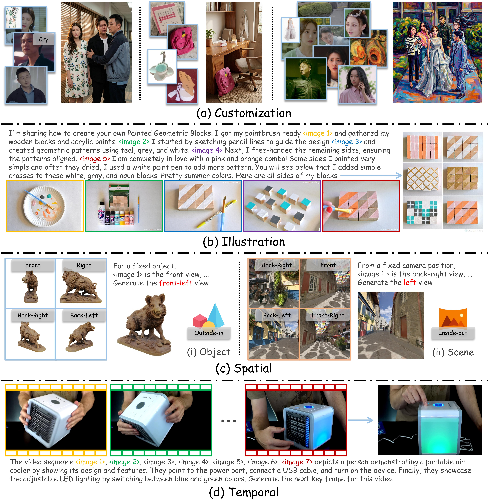

<p align="center">
  
</p>

# MACRO: Advancing Multi-Reference Image Generation with Structured Long-Context Data

<p align="center">
  <strong>Zhekai Chen<sup>1</sup>, Yuqing Wang<sup>1</sup>, Manyuan Zhang<sup>2</sup>, Xihui Liu<sup>*1</sup></strong>
  <br>
  <sup>1</sup>HKU MMLab &nbsp;&nbsp; <sup>2</sup>Meituan
</p>

<p align="center">
  <a href="https://macro400k.github.io/"></a>
  &nbsp;
  <a href="https://huggingface.co/datasets/Azily/Macro-Dataset"></a>
  &nbsp;
  <a href="https://arxiv.org/abs/XXXX.XXXXX"></a>
  &nbsp;
  <a href="https://huggingface.co/papers/XXXX.XXXXX"></a>
</p>

**Macro** is a multi-reference image generation dataset and benchmark. It covers four task categories — **Customization**, **Illustration**, **Spatial**, and **Temporal** — across four image-count brackets (1–3, 4–5, 6–7, ≥8 reference images). Alongside the dataset we provide fine-tuned checkpoints for three open-source models: **Bagel**, **OmniGen2**, and **Qwen-Image-Edit**.

---

## Table of Contents

1. [Inference, Batch Evaluation & Scoring](#1-inference-batch-evaluation--scoring)
   - 1.1 [Quick Single-Image Inference](#11-quick-single-image-inference)
   - 1.2 [Batch Inference on the Benchmark](#12-batch-inference-on-the-benchmark)
   - 1.3 [LLM-based Scoring](#13-llm-based-scoring)
2. [Dataset](#2-dataset)
   - 2.1 [Download](#21-download)
   - 2.2 [Structure](#22-structure)
   - 2.3 [Data Construction Pipeline (Reference Only)](#23-data-construction-pipeline-reference-only)
3. [Training](#3-training)
   - 3.1 [Environment Setup](#31-environment-setup)
   - 3.2 [Download Base Models](#32-download-base-models)
   - 3.3 [Prepare Training Data](#33-prepare-training-data)
   - 3.4 [Configure & Generate Training Scripts](#34-configure--generate-training-scripts)
   - 3.5 [Run Training](#35-run-training)

---

<p align="center">
  
</p>

---

## 1. Inference, Batch Evaluation & Scoring

### 1.1 Quick Single-Image Inference

Three ready-to-use test scripts are under `scripts/`. Each script falls back to a built-in sample (`assets/test_example/4-5_sample1.json`) when no prompt or images are given.

#### Download Fine-tuned Inference Checkpoints

| Checkpoint | HuggingFace |
|---|---|
| Macro-Bagel | [](https://huggingface.co/Azily/Macro-Bagel) |
| Macro-OmniGen2 | [](https://huggingface.co/Azily/Macro-OmniGen2) |
| Macro-Qwen-Image-Edit | [](https://huggingface.co/Azily/Macro-Qwen-Image-Edit) |

```bash
huggingface-cli download Azily/Macro-Bagel            --local-dir ckpts/Macro-Bagel
huggingface-cli download Azily/Macro-OmniGen2         --local-dir ckpts/Macro-OmniGen2
huggingface-cli download Azily/Macro-Qwen-Image-Edit  --local-dir ckpts/Macro-Qwen-Image-Edit
```

#### Common Arguments

All three test scripts share these arguments:

| Argument | Default | Description |
|---|---|---|
| `--prompt` | *(from sample)* | Text instruction |
| `--input_images` | *(from sample)* | One or more reference image paths |
| `--output` | `outputs/test_<model>.jpg` | Output image path |
| `--height` / `--width` | `768` | Output resolution |
| `--seed` | `42` | Random seed |

#### Bagel

```bash
# Default sample
python scripts/test_bagel.py

# Custom inputs
python scripts/test_bagel.py \
    --model_path ckpts/Macro-Bagel \
    --prompt "Generate an image of …" \
    --input_images img1.jpg img2.jpg
```

| Model Argument | Default | Description |
|---|---|---|
| `--model_path` | `ckpts/Macro-Bagel` | Fine-tuned Bagel checkpoint (also used as base model) |
| `--base_model_path` | *(same as `--model_path`)* | Override base model path (or env `BAGEL_BASE_MODEL_PATH`) |

#### OmniGen2

```bash
# Default sample
python scripts/test_omnigen.py

# Custom inputs
python scripts/test_omnigen.py \
    --model_path       ckpts/Macro-OmniGen2 \
    --transformer_path ckpts/Macro-OmniGen2/transformer \
    --prompt "Generate an image of …" \
    --input_images img1.jpg img2.jpg
```

| Model Argument | Default | Description |
|---|---|---|
| `--model_path` | `ckpts/Macro-OmniGen2` | OmniGen2 base model dir (or env `OMNIGEN_MODEL_PATH`) |
| `--transformer_path` | `ckpts/Macro-OmniGen2/transformer` | Fine-tuned transformer; omit to use the base model |
| `--enable_model_cpu_offload` | `False` | CPU offload to reduce GPU memory |

#### Qwen-Image-Edit

```bash
# Default sample
python scripts/test_qwen.py

# Custom inputs
python scripts/test_qwen.py \
    --model_base_path ckpts \
    --model_id        Macro-Qwen-Image-Edit \
    --prompt "Generate an image of …" \
    --input_images img1.jpg img2.jpg
```

| Model Argument | Default | Description |
|---|---|---|
| `--model_base_path` | `ckpts` | Root dir containing model sub-folders (or env `DIFFSYNTH_MODEL_BASE_PATH`) |
| `--model_id` | `Macro-Qwen-Image-Edit` | Sub-directory name under `model_base_path` |

---

### 1.2 Batch Inference on the Benchmark

Each model has a dedicated `inference/config.yaml`. Edit it to set checkpoint paths and tasks, then run:

```bash
# Run all checkpoints in the config
python bagel/inference/run.py   --config bagel/inference/config.yaml
python omnigen/inference/run.py --config omnigen/inference/config.yaml
python qwen/inference/run.py    --config qwen/inference/config.yaml

# Run a single checkpoint / task / category
python bagel/inference/run.py --config bagel/inference/config.yaml \
    --ckpt bagel_macro --task customization --category 4-5
```

The config files share a common structure:

```yaml
global_config:
  output_root: ./outputs/<model>   # where generated images are saved
  data_root:   ./data/filter        # evaluation data root

# YAML anchors for reusable task/category selections
common_tasks:
  all_tasks: &all_tasks
    customization: ["1-3", "4-5", "6-7", ">=8"]
    illustration:  ["1-3", "4-5", "6-7", ">=8"]
    spatial:       ["1-3", "4-5", "6-7", ">=8"]
    temporal:      ["1-3", "4-5", "6-7", ">=8"]

checkpoints:
  my_checkpoint:
    path: ./ckpts/...            # checkpoint path
    # transformer_path: ...      # optional: fine-tuned transformer (OmniGen2 / Qwen)
    # base_model_path:  ...      # optional: override base model path (Bagel only)
    tasks: *all_tasks
```

Results are written to `outputs/<model>/<checkpoint_name>/<task>/<category>/`.

> **Dynamic resolution** — input images are automatically resized based on reference image count:
> `[1M, 1M, 590K, 590K, 590K, 262K, 262K, 262K, 262K, 262K]` pixels for 1, 2, 3 … 10+ images.

---

### 1.3 LLM-based Scoring

#### Configure API credentials

**Option A — environment variables:**

```bash
# GPT / OpenAI-compatible endpoint
export OPENAI_URL=https://api.openai.com/v1/chat/completions
export OPENAI_KEY=your_openai_api_key

# Gemini  (default model: gemini-3.0-flash-preview)
export GEMINI_API_KEY=your_gemini_api_key
export GEMINI_MODEL_NAME=gemini-3.0-flash-preview  # optional
```

**Option B — `eval/config.yaml`** (overrides environment variables):

```yaml
global_config:
  api_config:
    openai:
      url: "https://api.openai.com/v1/chat/completions"
      key: "your_openai_api_key"
    gemini:
      api_key: "your_gemini_api_key"
      model_name: "gemini-3.0-flash-preview"
```

#### Configure evaluations

Edit `eval/config.yaml`:

```yaml
global_config:
  output_root: ./outputs   # must match inference output_root
  use_gpt:    false        # set true to enable GPT scoring
  use_gemini: true         # set true to enable Gemini scoring
  parallel_workers: 16

evaluations:
  bagel:
    bagel_macro:
      tasks: *all_tasks
  omnigen:
    omnigen2_macro:
      tasks: *all_tasks
  qwen:
    qwen_macro:
      tasks: *all_tasks
```

#### Run scoring

```bash
# Run all configured evaluations
python eval/run_eval.py

# Run a specific model / experiment
python eval/run_eval.py --baseline bagel   --exp bagel_macro
python eval/run_eval.py --baseline omnigen --exp omnigen2_macro
python eval/run_eval.py --baseline qwen    --exp qwen_macro
```

Scores are saved as JSON files alongside the generated images in `outputs/<model>/<exp>/<task>/<category>/`.

---

## 2. Dataset

### 2.1 Download

The Macro dataset is available on Hugging Face as a collection of `.tar.gz` archives:

[](https://huggingface.co/datasets/Azily/Macro-Dataset)

#### Step 1 — Download the archives

```bash
# Download all archives into data_tar/
huggingface-cli download Azily/Macro-Dataset --repo-type dataset --local-dir data_tar/
```

> **Selective download:** If you only need the evaluation benchmark (JSON index files, no images), download just `filter.tar.gz` (~510 MB):
> ```bash
> huggingface-cli download Azily/Macro-Dataset \
>     --repo-type dataset \
>     --include "filter.tar.gz" \
>     --local-dir data_tar/
> ```
>
> To download a specific task/split/category (e.g., customization train 1–3 images):
> ```bash
> huggingface-cli download Azily/Macro-Dataset \
>     --repo-type dataset \
>     --include "final_customization_train_1-3.tar.gz" \
>     --local-dir data_tar/
> ```

#### Step 2 — Extract

An extraction script `extract_data.sh` is included in the downloaded `data_tar/` folder. Run it from the project root to restore the original `data/` tree:

```bash
bash data_tar/extract_data.sh ./data_tar .
# Restores: ./data/filter/, ./data/final/, ./data/raw/
```

Or extract all archives manually:

```bash
for f in data_tar/*.tar.gz; do tar -xzf "$f" -C .; done
```

### 2.2 Structure

After extraction, the `data/` directory has the following layout:

```
data/
├── filter/                          # JSON index files for training & evaluation
│   ├── customization/
│   │   ├── train/
│   │   │   ├── 1-3/  *.json        # 20,000 training samples (1–3 ref images)
│   │   │   ├── 4-5/  *.json        # 20,000 training samples
│   │   │   ├── 6-7/  *.json        # 30,000 training samples
│   │   │   └── >=8/  *.json        # 30,000 training samples
│   │   └── eval/
│   │       ├── 1-3/  *.json        # 250 evaluation samples
│   │       ├── 4-5/  *.json        # 250 evaluation samples
│   │       ├── 6-7/  *.json        # 250 evaluation samples
│   │       └── >=8/  *.json        # 250 evaluation samples
│   ├── illustration/  (same layout; 25,000 train / 250 eval per category)
│   ├── spatial/       (same layout)
│   └── temporal/      (same layout)
├── final/                           # Actual image data, referenced by filter/ JSONs
│   ├── customization/
│   │   ├── train/
│   │   │   ├── 1-3/
│   │   │   │   ├── data/
│   │   │   │   │   ├── 00000000/
│   │   │   │   │   │   ├── image_1.jpg
│   │   │   │   │   │   ├── image_2.jpg   (etc.)
│   │   │   │   │   │   └── image_output.jpg
│   │   │   │   │   └── ...
│   │   │   │   └── json/  *.json   (raw generation metadata)
│   │   │   ├── 4-5/ ...
│   │   │   ├── 6-7/ ...
│   │   │   └── >=8/ ...
│   │   └── eval/ ...
│   ├── illustration/ ...
│   ├── spatial/ ...
│   └── temporal/ ...
└── raw/
    ├── t2i_example/
    │   ├── t2i_example.jsonl        # Placeholder T2I prompts (training format reference)
    │   └── images/                  # Placeholder images
    └── customization/               # Original source images used in data construction
        ├── cloth/  *.jpg
        ├── human/  *.jpg
        ├── object/ *.jpg
        ├── scene/  *.jpg
        ├── style/  *.jpg
        └── *_train.jsonl / *_eval.jsonl
```

Each JSON file in `data/filter/` contains:

```json
{
  "task": "customization",
  "idx": 1,
  "prompt": "Create an image of the modern glass and metal interior from <image 2>, applying the classical oil painting style from <image 1> globally across the entire scene.",
  "input_images": [
    "data/final/customization/train/1-3/data/00022018/image_1.jpg",
    "data/final/customization/train/1-3/data/00022018/image_2.jpg"
  ],
  "output_image": "data/final/customization/train/1-3/data/00022018/image_output.jpg"
}
```

> **Note:** All `input_images` and `output_image` paths are relative to the parent directory of `data/` (i.e., the project root). Place the extracted `data/` folder at the project root before running training or inference.

### 2.3 Data Construction Pipeline (Reference Only)

> ⚠️ **This section is for reference only.** The pipeline depends on internal cluster infrastructure and proprietary APIs that are not publicly available. It cannot be run directly as-is.

```
data/raw/  →  data/split/  →  data/final/  →  data/filter/
 (raw)         (split)        (generated)      (filtered, for training/eval)
```

**Stage 1 — Split:** split raw source data by task and image-count category.

```bash
python data_preprocess/split/customization.py
python data_preprocess/split/illustration.py
python data_preprocess/split/spatial.py
python data_preprocess/split/temporal.py
```

**Stage 2 — Generate:** produce instructions and synthetic target images with Gemini (text) and Nano (image) APIs.

```bash
python data_preprocess/gen/customization.py
python data_preprocess/gen/illustration.py
python data_preprocess/gen/spatial.py
python data_preprocess/gen/temporal.py
```

**Stage 3 — Filter:** score generated samples and keep those above a quality threshold.

```bash
python data_preprocess/filter/customization.py
python data_preprocess/filter/illustration.py
python data_preprocess/filter/spatial.py
python data_preprocess/filter/temporal.py
```

---

## 3. Training

### 3.1 Environment Setup

Each base model has its own training framework. Please follow the respective official installation guide before proceeding.

| Model | Framework | Installation |
|---|---|---|
| **Bagel** | [ByteDance-Seed/Bagel](https://github.com/ByteDance-Seed/Bagel) | Follow the official repo's environment setup |
| **OmniGen2** | [VectorSpaceLab/OmniGen2](https://github.com/VectorSpaceLab/OmniGen2) | Follow the official repo's environment setup |
| **Qwen-Image-Edit** | [modelscope/DiffSynth-Studio](https://github.com/modelscope/DiffSynth-Studio) | Install DiffSynth-Studio, then additionally install DeepSpeed: |

```bash
# Qwen-Image-Edit: after installing DiffSynth-Studio
pip install deepspeed
```

### 3.2 Download Base Models

| Local path | HuggingFace | Notes |
|---|---|---|
| `ckpts/BAGEL-7B-MoT` | [](https://huggingface.co/ByteDance-Seed/BAGEL-7B-MoT) | Bagel base model |
| `ckpts/Qwen2.5-7B-Instruct` | [](https://huggingface.co/Qwen/Qwen2.5-7B-Instruct) | LLM backbone for Bagel |
| `ckpts/OmniGen2` | [](https://huggingface.co/OmniGen2/OmniGen2) | OmniGen2 base model |
| `ckpts/FLUX.1-dev` | [](https://huggingface.co/black-forest-labs/FLUX.1-dev) | VAE / text encoder for OmniGen2 |
| `ckpts/Qwen2.5-VL-3B-Instruct` | [](https://huggingface.co/Qwen/Qwen2.5-VL-3B-Instruct) | VL encoder for OmniGen2 |
| `ckpts/Qwen-Image-Edit-2511` | [](https://huggingface.co/Qwen/Qwen-Image-Edit-2511) | Qwen-Image-Edit base model |

```bash
huggingface-cli download ByteDance-Seed/BAGEL-7B-MoT          --local-dir ckpts/BAGEL-7B-MoT
huggingface-cli download Qwen/Qwen2.5-7B-Instruct              --local-dir ckpts/Qwen2.5-7B-Instruct
huggingface-cli download OmniGen2/OmniGen2                     --local-dir ckpts/OmniGen2
huggingface-cli download black-forest-labs/FLUX.1-dev          --local-dir ckpts/FLUX.1-dev
huggingface-cli download Qwen/Qwen2.5-VL-3B-Instruct           --local-dir ckpts/Qwen2.5-VL-3B-Instruct
huggingface-cli download Qwen/Qwen-Image-Edit-2511             --local-dir ckpts/Qwen-Image-Edit-2511
```

### 3.3 Prepare Training Data

#### Multi-reference (IC) data

The `data/filter/` directory from [Section 2](#2-dataset) is used directly. Each `{task}/train/{category}/` folder is picked up automatically by the training configuration scripts.

#### T2I data

We do **not** provide T2I (text-to-image) pretraining data. Supply your own JSONL file:

```json
{"task_type": "t2i", "instruction": "A photo of …", "output_image": "path/to/image.jpg"}
```

Point to it in the model's `config.yaml`:

```yaml
global:
  t2i_data_path: data/raw/t2i_example/t2i_example.jsonl  # ← replace with your path
  default_t2i_ratio: 0.2   # fraction of T2I samples in a mixed batch
```

An illustrative placeholder is provided at `data/raw/t2i_example/t2i_example.jsonl`.
Set `use_t2i: false` in an experiment to skip T2I mixing entirely.

### 3.4 Configure & Generate Training Scripts

Each model uses a two-file workflow:

1. **`{model}/config.yaml`** — high-level experiment settings  
2. **`{model}/process_config.py`** — reads the config, preprocesses data, and writes a self-contained `run.sh` plus model-specific YAML files into `{model}/exps/{exp_name}/`

Key fields in `config.yaml`:

```yaml
global:
  multiref_data_root: data/filter       # downloaded filter data
  t2i_data_path: data/raw/t2i_example/t2i_example.jsonl
  default_learning_rate: 2e-5           # default; overridable per experiment
  default_num_epochs: 10

experiments:
  my_experiment:
    use_t2i: true           # mix T2I data into training
    t2i_ratio: 0.1          # 10 % of batches are T2I
    learning_rate: 2e-5     # optional per-experiment override
    data_config:
      customization:
        "1-3": {data_num: 1000}
        "4-5": {data_num: 1000}
      spatial:      ...
      illustration: ...
      temporal:     ...
```

Run `process_config.py`:

```bash
python bagel/process_config.py   --exp_name my_experiment
python omnigen/process_config.py --exp_name my_experiment
python qwen/process_config.py    --exp_name my_experiment
```

Generated files for each model:

```
bagel/exps/my_experiment/
├── run.sh
└── dataset_config.yaml

omnigen/exps/my_experiment/
├── run.sh
├── X2I2.yml      # OmniGen2 training config
├── ic.yml        # multi-reference data list
├── t2i.yml       # T2I data list
└── mix.yml       # mixed dataset config

qwen/exps/my_experiment/
├── run.sh
└── metadata/     # per-sample metadata
```

### 3.5 Run Training

```bash
bash bagel/exps/my_experiment/run.sh
bash omnigen/exps/my_experiment/run.sh
bash qwen/exps/my_experiment/run.sh
```

The scripts use `torchrun` and support multi-node setups via the `AFO_ENV_CLUSTER_SPEC` environment variable. Single-node training works with defaults.

Checkpoints are saved to `{model}/exps/{exp_name}/results/checkpoints/`.
To evaluate a trained checkpoint, add it to `{model}/inference/config.yaml` and follow [Section 1.2](#12-batch-inference-on-the-benchmark).

---

## Acknowledgements

We thank the authors and contributors of the following open-source projects that this work builds upon:

- **[Bagel](https://github.com/ByteDance-Seed/Bagel)** — ByteDance Seed's unified multimodal generation framework, which serves as one of our base models.
- **[OmniGen2](https://github.com/VectorSpaceLab/OmniGen2)** — VectorSpaceLab's versatile image generation model, which serves as one of our base models.
- **[Qwen-Image-Edit / DiffSynth-Studio](https://github.com/modelscope/DiffSynth-Studio)** — ModelScope's DiffSynth-Studio framework and the Qwen-Image-Edit model, which serve as one of our base models and training frameworks.

---

## Citation

If you find this work useful, please cite:

```bibtex
@article{chen2026macro,
  title     = {MACRO: Advancing Multi-Reference Image Generation with Structured Long-Context Data},
  author    = {Chen, Zhekai and Wang, Yuqing and Zhang, Manyuan and Liu, Xihui},
  journal   = {arXiv preprint arXiv:XXXX.XXXXX},
  year      = {2026},
  url       = {https://arxiv.org/abs/XXXX.XXXXX}
}
```
